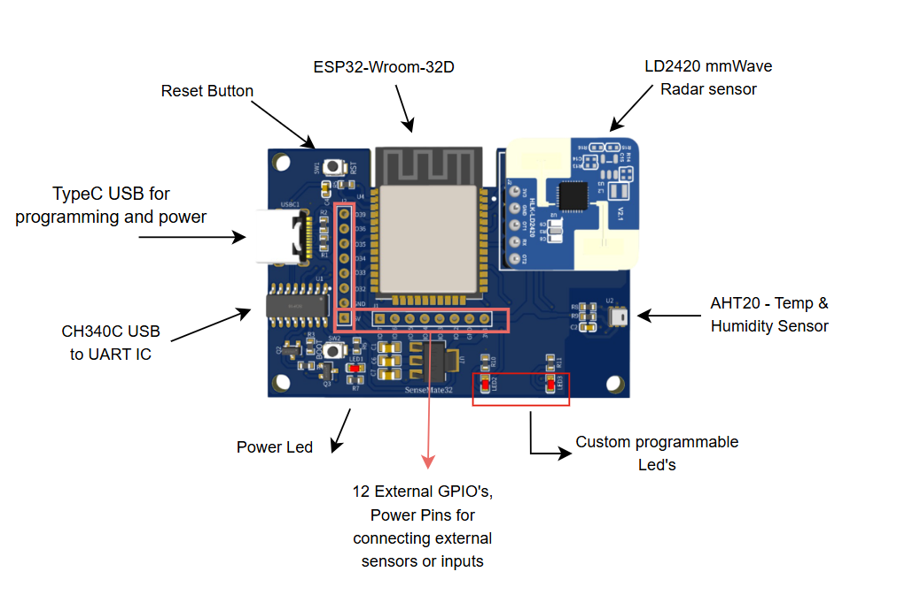

# SenseMate32

SenseMate32 is a compact and powerful DIY development board designed for intelligent sensing and automation projects. Built around the ESP32 microcontroller, it integrates advanced human presence detection and environmental monitoring sensors, making it an ideal platform for IoT, home automation, and smart environment applications.

